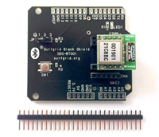
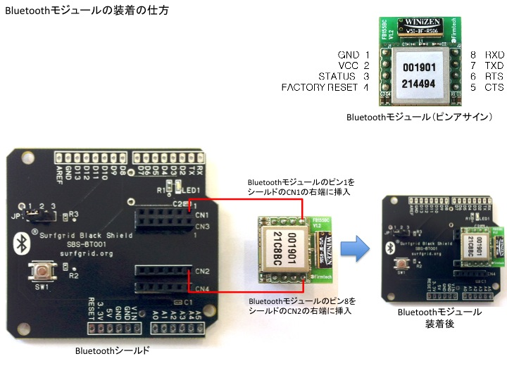
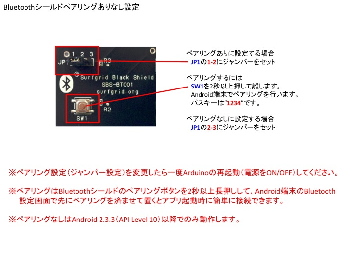
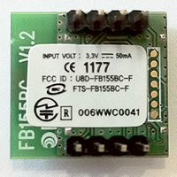

arduino-bluetooth
=================

AndroidとArduinoをBluetoothでつなごう

Arduino用スケッチソースコード
---------
* Arduino-0.9 (Arduino 0.9.x用)
* Arduino-1.0 (Arduino 1.x用)

Android用デモアプリサンプルソースコード
---------
* Android-2.0 (Android 2.0用)
* Arduino-2.3.3 (Arduino 2.3.3用)
* Android TwitterClientサンプルソースコード

Bluetoothシールド：SBS-BT001
---------

Bluetoothモジュールの装着方法
---------

Bluetoothシールドのペアリング方法
---------

Bluetoothモジュール：FB155BC
---------

FB155BCは、Bluetooth 2.1 Class 2に準拠した国内電波法認証取得済みのBluetoothモジュールです。
---------
* Bluetooth 2.1 Class 2
* Bluetooth SIG認証、国内電波法認証取得済み
* マスターでもスレーブでも使用可
* チップアンテナ搭載
* 搭載プロファイル：　SPP
* ATコマンドによるカンタン操作
* シリアル通信：　1200〜230400bps
* 動作電圧：　3.3V
* ピンピッチ：　2.54mmピッチ
　ブレッドボードにそのまま挿せます！
* ユーザーガイド (<http://www.firmtech.co.kr/02download/bluetooth/manual/FB155_User_Guide(Eng).pdf>)
* ATコマンド説明書（<http://www.firmtech.co.kr/02download/datasheet/appendix/AppendixB_Eng.pdf>）

